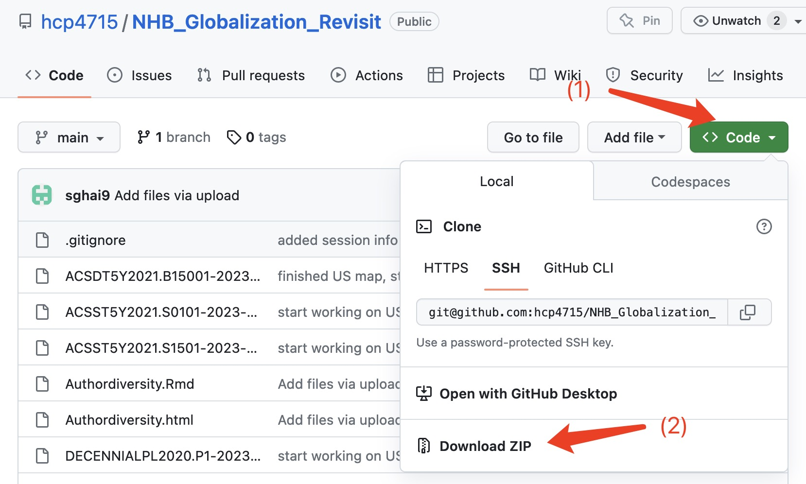

# NHB_Globalization_Revisit

This repo is for re-analyzing data from [Ruggeri et al (2022, NHB)](https://www.nature.com/articles/s41562-022-01392-w). Here we conduct two sets of analysis:

A)  Sample diversity: We selected a subset of their data and compared participant demographics in three countries across the low-middle-high income classification to the actual census data within each country. (Main Script: Re-analysis.RMD). Related data files:

-   A1. Re_Analysis_CHN.RData
-   A2. Re_Analysis_NG.RData
-   A3. Re_Analysis_USA.RData
-   A4. NG_pop_2019_wiki.csv \#
-   A5. DECENNIALPL2020.P1-2023-02-08T080125.csv \# US data for geographical distribution
-   A6. ACSST5Y2021.S0101-2023-02-08T075713.csv \# US census data
-   A7. ACSDT5Y2021.B15001-2023-02-08T135043.csv \# US data with educational attainment

B)  Author diversity: We compared each of the 171 authors country of institution to understand the extent to which local collaborators were included (Main Script: Authordiversity.RMD). Related data files:

-   B1. Ruggeri et al 2022_author diversity.xlsx
-   B2. Ruggeri et al 2022_country diversity.xlsx

Session information:

```         
R version 4.2.3 (2023-03-15)
Platform: x86_64-apple-darwin17.0 (64-bit)
Running under: macOS Ventura 13.3.1

Matrix products: default
LAPACK: /Library/Frameworks/R.framework/Versions/4.2/Resources/lib/libRlapack.dylib

locale:
[1] en_US.UTF-8/en_US.UTF-8/en_US.UTF-8/C/en_US.UTF-8/en_US.UTF-8

attached base packages:
[1] grid      stats     graphics  grDevices utils     datasets  methods   base     

other attached packages:
 [1] ggpubr_0.6.0       knitr_1.42         gtsummary_1.7.0    plyr_1.8.8         readxl_1.4.2       sf_1.0-12          ggspatial_1.1.8   
 [8] ggsn_0.5.0         mapproj_1.2.11     maps_3.4.1         maptools_1.1-6     rgdal_1.6-6        sp_1.6-0           RColorBrewer_1.1-3
[15] geojsonsf_2.0.3    tidycensus_1.3.2   interactions_1.1.5 lmerTest_3.1-3     lme4_1.1-33        Matrix_1.5-3       emmeans_1.8.5     
[22] data.table_1.14.8  bruceR_0.8.10      here_1.0.1         patchwork_1.1.2    see_0.7.5          report_0.5.7       parameters_0.21.0 
[29] performance_0.10.3 modelbased_0.8.6   insight_0.19.1     effectsize_0.8.3   datawizard_0.7.1   correlation_0.8.4  bayestestR_0.13.1 
[36] easystats_0.6.0    lubridate_1.9.2    forcats_1.0.0      stringr_1.5.0      dplyr_1.1.2        purrr_1.0.1        readr_2.1.4       
[43] tidyr_1.3.0        tibble_3.2.1       ggplot2_3.4.2      tidyverse_2.0.0    pacman_0.5.1      

loaded via a namespace (and not attached):
 [1] uuid_1.1-0           backports_1.4.1      jtools_2.2.1         systemfonts_1.0.4    splines_4.2.3        digest_0.6.31       
 [7] htmltools_0.5.5      fansi_1.0.4          magrittr_2.0.3       tzdb_0.3.0           timechange_0.2.0     jpeg_0.1-10         
[13] colorspace_2.1-0     rvest_1.0.3          rappdirs_0.3.3       textshaping_0.3.6    xfun_0.39            crayon_1.5.2        
[19] jsonlite_1.8.4       tigris_2.0.1         glue_1.6.2           gtable_0.3.3         car_3.1-2            abind_1.4-5         
[25] scales_1.2.1         mvtnorm_1.1-3        DBI_1.1.3            rstatix_0.7.2        Rcpp_1.0.10          units_0.8-1         
[31] foreign_0.8-84       proxy_0.4-27         httr_1.4.5           pkgconfig_2.0.3      farver_2.1.1         sass_0.4.5          
[37] utf8_1.2.3           tidyselect_1.2.0     labeling_0.4.2       rlang_1.1.0          munsell_0.5.0        cellranger_1.1.0    
[43] tools_4.2.3          cli_3.6.1            generics_0.1.3       ggmap_3.0.2          broom_1.0.4          evaluate_0.20       
[49] fastmap_1.1.1        yaml_2.3.7           ragg_1.2.5           naijR_0.5.1          pander_0.6.5         RgoogleMaps_1.4.5.3 
[55] nlme_3.1-162         xml2_1.3.3           compiler_4.2.3       rstudioapi_0.14      png_0.1-8            e1071_1.7-13        
[61] ggsignif_0.6.4       mapdata_2.3.1        gt_0.9.0             broom.helpers_1.13.0 stringi_1.7.12       lattice_0.20-45     
[67] commonmark_1.9.0     markdown_1.6         classInt_0.4-9       nloptr_2.0.3         vctrs_0.6.2          pillar_1.9.0        
[73] lifecycle_1.0.3      estimability_1.4.1   bitops_1.0-7         R6_2.5.1             KernSmooth_2.23-20   boot_1.3-28.1       
[79] MASS_7.3-58.2        rprojroot_2.0.3      withr_2.5.0          hms_1.1.3            class_7.3-21         minqa_1.2.5         
[85] rmarkdown_2.21       carData_3.0-5        numDeriv_2016.8-1.1 
```

## Reproducing this analysis

**Note**

You should have installed [R](https://cran.r-project.org/) and [Rstudio](https://posit.co/downloads/) in you machine before you trying to reproduce the analyses here.

For readers who are familiar with git and Github, you can either for this repo or clone it to your machine.

For readers who are not familiar with Github, please (1) find the green button "Code" and click the small triangle to show the options, and (2) click "Download ZIP" to download all the code and data shared here. See the figure below:



After downloading the zip file, unzip it and enter the folder "NHB_Globalization_Revisit-main", then double click "Re_Analysis.Rproj", which will open a Rstudio window if you have R and Rstudio installed.
